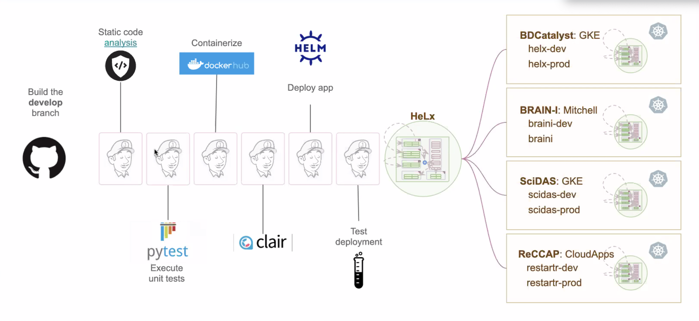

# Continuous Integration/Continuous Delivery




##
## Build

### Jenkins
1) General Approach
2) System Architecture\
    a) Machine User\
    b) Docker\
    c) Kubernetes
3) Build Scripts
4) Versioning\
There are two types of versioning currently used in HeLX CICD, manual and automatic. Most projects use automatic versioning with a small number (2-3) still using the older manual approach. They will be converted eventually so that there's only one versioning approach.
  
    a) Manual\
    Manual versioning works with the use of a hidden .ver file which contains the version number. This file typically lives in the top level bin directory or in some cases in docker/bin where the comp shell scripts exists. Developers increment the version in this file when they wish to bump the version up. TranQL is an example of a project currently using this type of versioning. Code typically retrieves the version in a build script this way:
    ```````````````````````````````
    ver=$(cat ./docker/bin/.ver)
    ```````````````````````````````
    This can help identify manually versioned build scripts.  
    
    b) Automatic\
    Automatic versioning uses two bash functions and a version files on the jenkins server to manage version numbers. These functions, get_ver and incr_ver, live in bash_lib on GitHub in the devops repo. The version files are initially set by the build script under the jobs directory for the project's build. For example, for the develop build for appstore, the version file will be set at:
    `````````````````````````````````````````````````
    $JENKINS_HOME/jobs/appstore/version/develop/ver
    `````````````````````````````````````````````````
    The format of the version file is:
    `````````````````````````````````````````````````
    vN.N.NN
    `````````````````````````````````````````````````
    where 'v' is simply the letter 'v', each N stands for a single integer 0-9, and '.' is the decimal point.\
    incr_ver is set up to increment the two digit portion from 1-99 and the single digit portions from 0-9. If a need arises to increment an image differently, for example, to go from v0.0.48 to v1.0.0, the file can be edited manually, and the automation will continue incrementing at v1.0.1.

## Unit Test

## Lint

## Security Scan

## Dashboard
